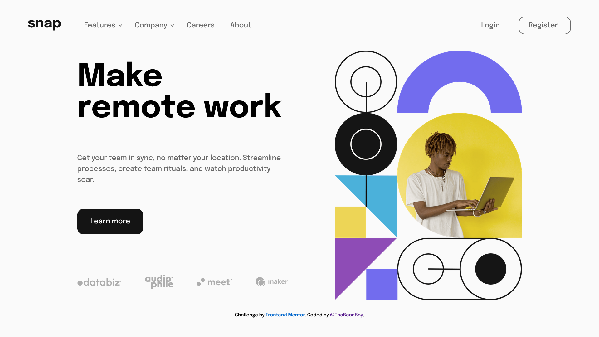

# Frontend Mentor - Intro section with dropdown navigation solution

This is a solution to the [Intro section with dropdown navigation challenge on Frontend Mentor](https://www.frontendmentor.io/challenges/intro-section-with-dropdown-navigation-ryaPetHE5). Frontend Mentor challenges help you improve your coding skills by building realistic projects.

## Table of contents

- [Frontend Mentor - Intro section with dropdown navigation solution](#frontend-mentor---intro-section-with-dropdown-navigation-solution)
  - [Table of contents](#table-of-contents)
  - [Overview](#overview)
    - [The challenge](#the-challenge)
    - [Screenshots](#screenshots)
    - [Links](#links)
  - [My process](#my-process)
    - [Built with](#built-with)
    - [What I learned](#what-i-learned)
    - [Continued development](#continued-development)
    - [Useful resources](#useful-resources)
  - [Author](#author)
  - [Acknowledgments](#acknowledgments)

## Overview

### The challenge

Users should be able to:

- View the relevant dropdown menus on desktop and mobile when interacting with the navigation links
- View the optimal layout for the content depending on their device's screen size
- See hover states for all interactive elements on the page

### Screenshots




### Links

- [Repo](https://github.com/ThaBeanBoy/Intro-Section-With-Dropdown-Navigation)
- [Live Site](https://intro-section-with-dropdown-navigation-self.vercel.app/)

## My process

### Built with

- Semantic HTML5 markup
- React Js
- [Scss](https://sass-lang.com/)
- Flexbox
- Desktop-first workflow
- [React Js](https://reactjs.org/)
- [Framer Motion](https://www.framer.com/motion/)

### What I learned

This is the first project where I could use react js. It was a really enjoyable process. During this project, I really could explore an idea that I've had for some time, making individaul components responsive instead of focusing on the whole page itself.

A big benefit to using React Js was that through the use of components, & hooks, making nav elements was super easy. I could encapsulate all the logic & functionality within that component. It would handle how it would function & function based on the props provided.

```jsx
<nav>
  <NavElement name='Features' subNavs={featuresSubNavs} />
  <NavElement name='Company' subNavs={companySubNavs} />
  <NavElement name='Careers' />
  <NavElement name='About' />
</nav>
```

It was my first time exploring animation libraries for react. I used [Framer Motion](https://www.framer.com/motion/) to do the job. So far I'm able to do simple animations with it, but I don't think it should be too different from animating using css. Here's an example of an animation.

```jsx
const [showSubNav, setShowSubNav] = useState(false);
const animationProps = {
  height: showSubNav ? 'auto' : 0,
  paddingTop: showSubNav ? 24 : 0,
  paddingBottom: showSubNav ? 24 : 0,
  marginTop: showSubNav ? 24 : 0,
};

// In return of a react functional component
<motion.ul
  animate={{ ...animationProps }}
  transition={{ type: 'just', duration: 0.5 }}
  onMouseEnter={() => (!mobileView ? setShowSubNav(true) : {})}
  onMouseLeave={() => (!mobileView ? setShowSubNav(false) : {})}
>
```

### Continued development

Since using React Js, I have had a sudden urge to work with react in every project. There are a couple of things I'd love to learn though.

- [Gatsby](https://www.gatsbyjs.com/) - The one drawback to using React Js is that it is not SEO friendly. Luckily I can still continue with React, & use Gatsby as a SSG(Static Site Generator).
- [Framer Motion](https://www.framer.com/motion/) - I'd love to improve upon my animation skills. It's the subtle animations that can make a site feel & look professional. I also believe that it can make a site feel alive.

### Useful resources

- [React Js](https://reactjs.org/) - This is an amazing article which helped me finally understand XYZ. I'd recommend it to anyone still learning this concept.
- [Framer Motion](https://www.framer.com/motion/) -
- [Scss](https://www.example.com) - This helped me for XYZ reason. I really liked this pattern and will use it going forward.

## Author

- GitHub - [@ThaBeanBoy](https://github.com/ThaBeanBoy)
- Frontend Mentor - [@ThaBeanBoy](https://www.frontendmentor.io/profile/ThaBeanBoy)
- Twitter - [@HeizenburgM](https://twitter.com/HeizenburgM)
- Instagram - [tiin_giib_chiip](https://www.instagram.com/tiin_giib_chiip/)

## Acknowledgments

I'd like to give a big shout out to [The Net Ninja](https://www.youtube.com/c/TheNetNinja), His playlists kick started my love for react & inspired the use of [Framer Motion](https://www.framer.com/motion/).
